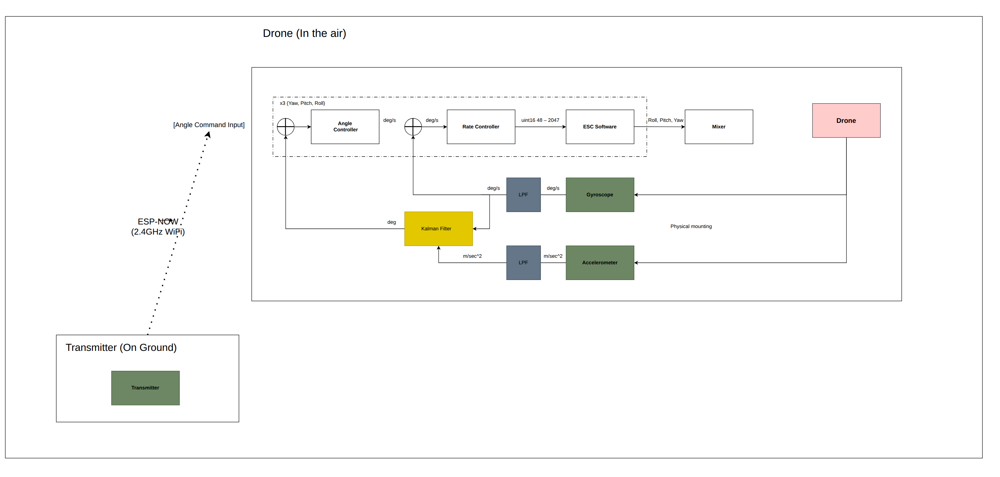

# Drone Flight Software

> **Status: in active development.** This firmware is being built alongside [drone-transmitter](https://github.com/ja-zoe/drone-transmitter) and [drone-software-common](https://github.com/ja-zoe/drone-software-common). Expect incomplete features and frequent changes.

ESP-IDF firmware for the flight controller of a custom-built drone. It receives control packets from a handheld transmitter over ESP-NOW, fuses onboard sensor data, and (eventually) closes the control loop that drives the motors.

## Control system



The transmitter on the ground sends angle commands over ESP-NOW (2.4 GHz WiFi). On the drone, a cascaded controller (angle controller feeding a rate controller, one instance each for yaw, pitch, and roll) produces motor commands through the ESC software and mixer. Attitude feedback comes from a gyroscope and accelerometer, each low-pass filtered and fused by a Kalman filter.

The source diagram is [`Drone-Control-System.drawio`](Drone-Control-System.drawio), editable at [diagrams.net](https://app.diagrams.net).

## Hardware

- ESP32 flight controller (custom PCBs live in [drone-receiver-board](https://github.com/ja-zoe/drone-receiver-board) and [drone-power-board](https://github.com/ja-zoe/drone-power-board))
- MPU6050 IMU (gyroscope + accelerometer)
- BMP280 barometric pressure sensor
- QMC5883P magnetometer

## Project structure

```
main/
  main.c            # NVS/WiFi/ESP-NOW/I2C init, shared state, task startup
  config/           # pin assignments, peer MAC address, logging strategy
  espnow/           # ESP-NOW send/receive layer
  tasks/            # FreeRTOS tasks (controls receive, telemetry logging)
components/
  drone-software-common/  # git submodule: shared packet definitions
  fourslot/               # four-slot async buffer for lock-free data sharing
```

Control and telemetry packet layouts are defined in [drone-software-common](https://github.com/ja-zoe/drone-software-common), shared as a git submodule so the transmitter and flight software always agree on the wire format.

## Building

Requires the [ESP-IDF toolchain](https://docs.espressif.com/projects/esp-idf/en/latest/esp32/get-started/index.html).

```bash
git clone --recurse-submodules git@github.com:ja-zoe/drone-flight-software.git
cd drone-flight-software
idf.py build
idf.py -p <PORT> flash monitor
```

Set the transmitter's MAC address in `main/config/config.h` (`ESPNOW_PEER_ADDR_CONF`) so the ESP-NOW link pairs with your transmitter.
